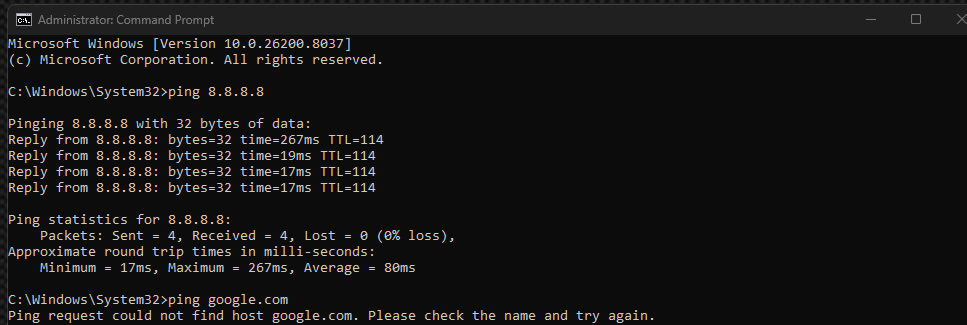
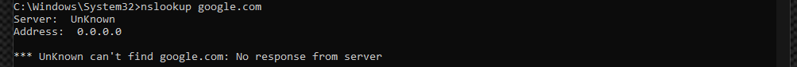
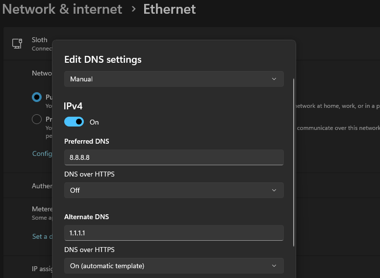
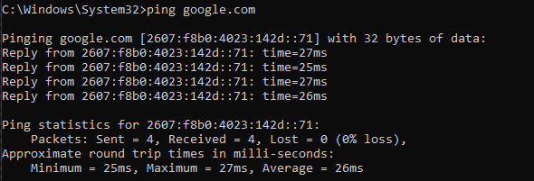

## Problem
User reports internet is connected but websites fail to load.

## Environment
Windows system with manual DNS configuration.

## Steps Taken
- Verified network connectivity using 'ping 8.8.8.8' (successful)
- Tested DNS resolution using 'ping google.com' (failed)

- Used 'nslookup google.com' to test DNS resolution
- Confirmed DNS failure via 'nslookup google.com' returning invalid server (0.0.0.0)

  
- Updated DNS settings

- Verified domain connection to google.com (successful)

## Tools Used
- Windows Command Prompt
- ping
- nslookup
- ipconfig

## Resolution
- Updated DNS servers to 8.8.8.8 and 1.1.1.1
- Flushed DNS cache using 'ipconfig /flushdns'
- Re-enabled IPv6 to restore full network stack functionality

## Outcome
Successfully restored internet functionality by correcting DNS configuration.
